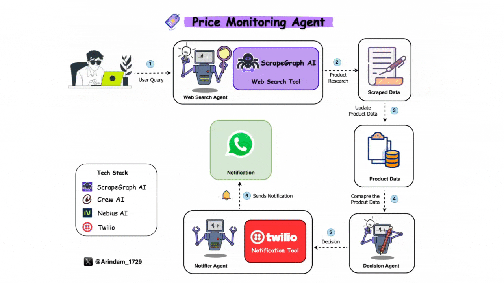

# 💲 Price Monitoring Agent

An advanced AI-powered price monitoring and alert system that tracks product prices and availability from e-commerce websites, detects significant changes, and instantly sends alerts via SMS/WhatsApp. Built with ScrapeGraph AI, CrewAI, Loose AI Engine, Twilio, and Streamlit.

## 🚀 Features

- **Automated Price Tracking**: Real-time monitoring of product prices & stock availability
- **Intelligent Web Scraping**: ScrapeGraph AI extracts product data from dynamic web pages
- **Smart Workflow Automation**: CrewAI coordinates fetching, analysis, and alerting tasks
- **AI-Powered Change Detection**: Loose AI Engine identifies significant price or availability changes
- **Instant Notifications**: Twilio sends SMS/WhatsApp alerts
- **Scheduled Monitoring**: APScheduler runs checks at user-defined intervals
- **Data Persistence**: Product data stored in JSON for historical comparison
- **User-Friendly Dashboard**: Streamlit interface to add and manage products

# Workflow



## 🛠️ Tech Stack

- **Python**: Core programming language
- **Streamlit**: Interactive web dashboard
- **ScrapeGraph AI**: Intelligent web scraping
- **CrewAI**: Agent-based workflow automation
- **Loose AI Engine**: AI-based data analysis
- **Twilio API**: SMS/WhatsApp notification service
- **APScheduler**: Scheduled task automation
- **JSON**: Lightweight database for product data

## 📦 Getting Started

### Prerequisites

- Python 3.9+
- [uv](https://github.com/astral-sh/uv) package manager (used instead of pip)
- [ScrapeGraph](https://dub.sh/scrapegraphai) Account
- A [Twilio account](https://dub.sh/twilio) with a phone number that can send SMS/WhatsApp messages
- [Loose](https://dub.sh/Loose) Account & API keys

### Environment Variables

Create an `api.env` file in the project root with the following variables:

```env
TWILIO_ACCOUNT_SID="your_twilio_account_sid"
TWILIO_AUTH_TOKEN="your_twilio_auth_token"
TWILIO_PHONE_NUMBER="your_twilio_phone_number"
TWILIO_WHATSAPP_NUMBER="your_twilio_whatsapp_number"
Loose_API_KEY="your_Loose_api_key"
SCRAPHGRAPH_API_KEY="your_scrapegraph_api_key"
CLIENT_WHATSAPP_NO="your_phone_number"
CLIENT_PHONE_NO="your_whatsapp_number"
```

**Note:** The numbers you add for `CLIENT_WHATSAPP_NO` and `CLIENT_PHONE_NO` must be active and registered with Twilio to receive notifications.

### Installation

1. **Clone the repository:**

   ```bash
   git clone https://github.com/looseai-project/looseai.git
   cd advance_ai_agents/price_monitoring_agent
   ```

2. **Install dependencies using uv:**

   ```bash
   uv sync
   ```

3. **Activate the virtual environment:**

   - **On macOS/Linux:**
     ```bash
     source .venv/bin/activate
     ```
   - **On Windows:**
     ```bash
     .venv\Scripts\activate
     ```

## ⚙️ Usage

1. **Run the Streamlit Dashboard:**

   ```bash
   streamlit run app.py
   ```

2. **Run the Background Scheduler:**

   ```bash
   uv pip run scheduler.py
   ```

## 📖 How It Works

1. **Product Tracking**: Add product URLs via the Streamlit UI
2. **Scraping**: ScrapeGraph AI extracts product title, price, and stock status
3. **Change Detection**: Loose AI Engine analyzes new data and compares with previous data
4. **Alerting**: Twilio sends SMS/WhatsApp notifications if significant changes are detected
5. **Automation**: APScheduler runs checks automatically at fixed intervals

## 📂 Project Structure

```
price-monitoring-agent/
├── agents/
│   ├── crewai_agents.py
│   └── decision_logic.py
├── assets/
│   └── Loose.png
├── notifier/
│   └── email_notifier.py
├── tools/
│   └── custom_tools.py
├── .venv/
├── api.env
├── app.py
├── product_data.json
├── requirements.txt
├── scheduler.py
└── tracked_urls.json
```

## 🤝 Contributing

Contributions are welcome! Please submit a pull request or open an issue to discuss changes.

## 📄 License

This project is licensed under the MIT License - see the [LICENSE](LICENSE) file for details.
