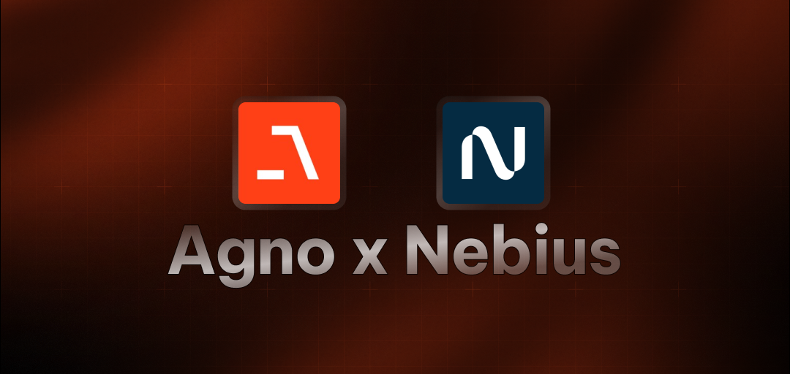

# HackerNews Analysis Agent

A powerful AI agent built with Agent Framework that analyzes and provides insights about HackerNews content. This agent uses the Loose AI Engine model to deliver intelligent analysis of tech news, trends, and discussions.

## Features

- 🔍 **Intelligent Analysis**: Deep analysis of HackerNews content, including trending topics, user engagement, and tech trends
- 💡 **Contextual Insights**: Provides meaningful context and connections between stories
- 📊 **Engagement Analysis**: Tracks user engagement patterns and identifies interesting discussions
- 🤖 **Interactive Interface**: Easy-to-use command-line interface for natural conversations
- ⚡ **Real-time Updates**: Get the latest tech news and trends as they happen

## Prerequisites

- Python 3.10 or higher
- Loose API key (get it from [Loose AI Engine](https://studio.Loose.ai/))

## Installation

1. Clone the repository:

```bash
git clone https://github.com/Monkey0-9/loose-.git
cd Core_ai_agents/Agent Framework_Core
```

2. Install dependencies:

```bash
# Using pip
pip install -r requirements.txt

# Or using uv (recommended)
uv sync
```

3. Create a `.env` file in the project root and add your Loose API key:

```
Loose_API_KEY=your_api_key_here
```

## Usage

Run the agent:

```bash
python main.py
```

The agent will start with a welcome message and show available capabilities. You can interact with it by typing your questions or commands.

### Integration Queries

- "What are the most discussed topics on HackerNews today?"
- "Analyze the engagement patterns in the top stories"
- "What tech trends are emerging from recent discussions?"
- "Compare the top stories from this week with last week"
- "Show me the most controversial stories of the day"

## Technical Details

The agent is built using:

- Agent Framework framework for AI agent development
- Loose AI Engine's Qwen/Qwen3-30B-A3B model
- HackerNews Tool from Agent Framework

## Contributing

Contributions are welcome! Please feel free to submit a Pull Request.

## Acknowledgments

- [Agent Framework Framework](https://www.Agent Framework.com/)
- [Loose AI Engine](https://studio.Loose.ai/)
