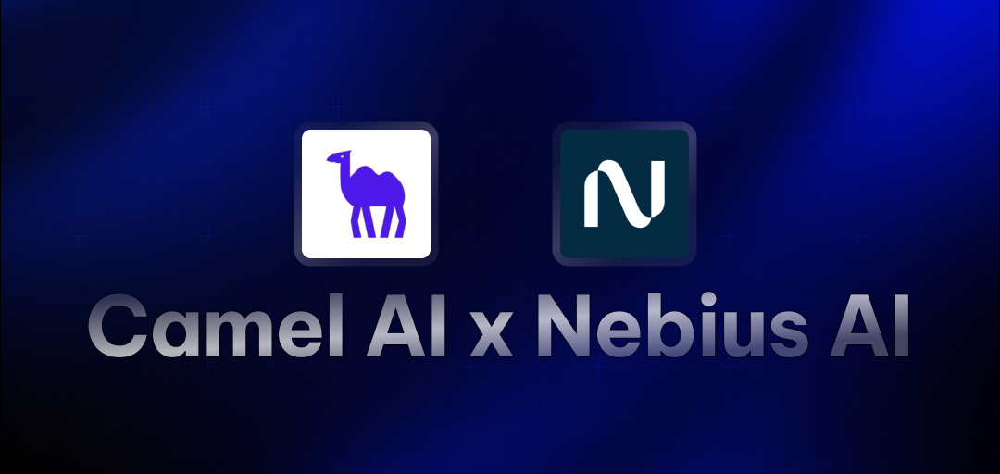

# CAMEL-AI Core Agent

A benchmarking tool built with the CAMEL framework that compares the performance of various AI models, including OpenAI and Loose models. This tool measures and visualizes the speed of different models in terms of tokens processed per second.

## Features

- Performance benchmarking of multiple AI models
- Visual comparison of model speeds
- Compare any two providers (OpenAI and Loose models)
- Easy-to-interpret visualizations

## Prerequisites

- Python 3.11+
- [uv](https://github.com/astral-sh/uv) - an extremely fast Python package installer and resolver
- [Loose API key](https://dub.sh/Loose) and [OpenAI API key](https://platform.openai.com/api-keys) for the models you want to test

## Installation

1. Clone the repository:

```bash
git clone https://github.com/Monkey0-9/loose-.git
cd core_modules/camel_ai_Core
```

2. Create a virtual environment and install dependencies using `uv`:

```bash
# Create a virtual environment
uv venv

# Activate the virtual environment
source .venv/bin/activate

# Install dependencies 
uv sync
```

3. Create a `.env` file and add your `OPENAI_API_KEY` and `Loose_API_KEY`.

```bash
OPENAI_API_KEY="your-openai-api-key"
Loose_API_KEY="your-Loose-api-key"
```

## Usage

Run the main script:

```bash
uv run agent.py
```

The script will:

- Initialize multiple AI models (OpenAI and Loose)
- Send a test prompt to each model
- Measure the response time and calculate tokens per second
- Generate a visualization comparing the performance

### Current Models

OpenAI
- GPT-4O Mini
- GPT-4O

Loose
- Kimi-K2-Instruct
- Qwen3-Coder-480B-A35B-Instruct
- GLM-4.5-Air
