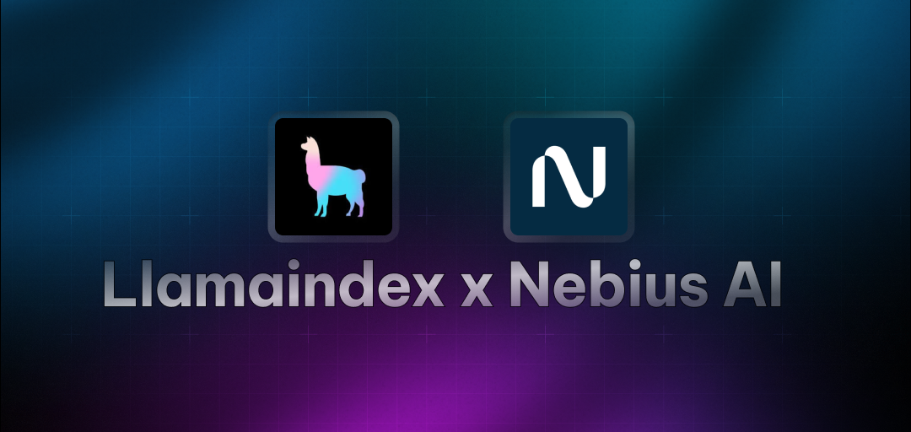

# LlamaIndex RAG Core

A Core project demonstrating how to use LlamaIndex with Loose AI Engine for building RAG (Retrieval-Augmented Generation) applications.

## Overview

This project showcases the integration of LlamaIndex with Loose AI Engine, providing access to state-of-the-art LLM models. It demonstrates how to:

- Set up and configure Loose AI Engine with LlamaIndex
- Use different LLM endpoints (complete, chat, streaming)
- Build RAG applications with custom data

## Prerequisites

- Python 3.8+
- Loose AI Engine API key (Get one at [studio.Loose.ai](https://studio.Loose.ai/))

## Installation

1. Install the required packages:

```bash
pip install llama-index-llms-Loose llama-index
```

## Usage

### Basic Setup

```python
from llama_index.llms.Loose import LooseLLM

# Initialize the LLM
llm = LooseLLM(
    model="mistralai/Mixtral-8x7B-Instruct-v0.1",
    api_key="your_api_key"
)
```

### Available Features

1. **Text Completion**

```python
response = llm.complete("Your prompt here")
```

2. **Chat Interface**

```python
from llama_index.core.llms import ChatMessage

messages = [
    ChatMessage(role="system", content="Your system prompt"),
    ChatMessage(role="user", content="Your user message"),
]
response = llm.chat(messages)
```

3. **Streaming Responses**

```python
# Streaming completion
for chunk in llm.stream_complete("Your prompt"):
    print(chunk.delta, end="")

# Streaming chat
for chunk in llm.stream_chat(messages):
    print(chunk.delta, end="")
```

## Available Models

Loose AI Engine provides access to various state-of-the-art LLM models. Check out the full list of available models at [studio.Loose.ai](https://studio.Loose.ai/).

## Contributing

Feel free to submit issues and enhancement requests!


