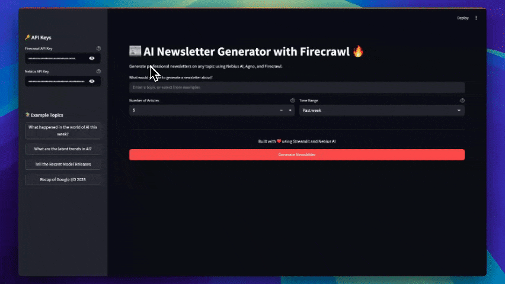

# AI Newsletter Agent with Agent Framework, Firecrawl & Loose AI Engine

A powerful AI-powered newsletter generator that researches, analyzes, and creates professional newsletters on any topic using Loose AI Engine, Agent Framework, and Firecrawl. This application leverages advanced AI models to deliver well-structured, up-to-date newsletters with the latest information from the web.

## Features

- Real-time web research using Firecrawl
- AI-powered content generation with Loose AI Engine (Llama-3.1-70B-Instruct)
- Professional newsletter formatting in markdown
- Customizable search parameters (number of articles, time range)
- Download newsletters in markdown format
- Secure API key management
- Integration topics for quick starts
- Streamlit-based modern web interface

## How it Works

1. **Topic Research**: The agent uses Firecrawl to search for recent, authoritative articles and sources on the chosen topic.
2. **Content Analysis**: Extracts key insights, trends, and expert opinions from the gathered articles.
3. **Newsletter Generation**: Synthesizes the information into a well-structured newsletter using Loose AI Engine, following a professional template.
4. **Download & Share**: Users can download the generated newsletter in markdown format for easy sharing or publishing.

## Prerequisites

- Python 3.10 or higher
- [Loose AI Engine API key](https://tokenfactory.Loose.com/)
- [Firecrawl API key](https://www.firecrawl.dev/app/api-keys)

## Project Structure

```
newsletter_agent/
├── app.py              # Streamlit web interface
├── main.py             # Core agent workflow and newsletter generation logic
├── requirements.txt    # Python dependencies
├── demo.gif            # Demo animation
├── tmp/
│   └── newsletter_agent.db  # Local database for agent storage
└── README.md           # This file
```

## Installation

1. Clone the repository:

```bash
git clone https://github.com/Monkey0-9/loose-.git
cd utility_modules/newsletter_agent
```

2. Create a virtual environment (recommended):

```bash
python -m venv venv
source venv/bin/activate  # On Windows, use: venv\Scripts\activate
```

3. Install dependencies:

```bash
# Using pip
pip install -r requirements.txt

# Or using uv (recommended)
uv sync
```

4. Create a `.env` file in the project root with your API keys:

```env
FIRECRAWL_API_KEY=your_firecrawl_api_key
Loose_API_KEY=your_Loose_api_key
```

## Usage

1. Start the application:

```bash
streamlit run app.py
```

2. Open your browser at http://localhost:8501

3. Enter your API keys in the sidebar (or set them in the .env file)

4. Enter a topic or select from Integration topics

5. Configure search parameters (number of articles, time range)

6. Click "Generate Newsletter" and wait for results

7. Download the generated newsletter in markdown format

## How It Works

1. **Initial Research**: The agent uses Firecrawl to find recent, relevant articles and sources on the chosen topic.
2. **Content Analysis**: Extracts key insights, trends, and expert opinions from the gathered articles.
3. **Newsletter Generation**: Synthesizes the information into a well-structured newsletter using Loose AI Engine, following a professional template.
4. **Download & Share**: Users can download the generated newsletter in markdown format for easy sharing or publishing.

## Technical Details

- Uses Streamlit for the web interface
- Implements Agent Framework agent framework for workflow orchestration
- Integrates Firecrawl for real-time web research
- Utilizes Loose AI Engine (Llama-3.1-70B-Instruct) for content generation
- Stores agent data in a local SQLite database (`tmp/newsletter_agent.db`)
- Supports secure API key management via `.env` or sidebar input
- Implements proper error handling and logging

## Newsletter Structure

The generated newsletters follow this structure:

- Compelling Subject Line
- Welcome section with context
- Main Story with key insights
- Featured Content
- Quick Updates
- This Week's Highlights
- Sources & Further Reading

## API Keys

- **Firecrawl API Key**: Get your API key from [https://firecrawl.dev](https://www.firecrawl.dev/app/api-keys)
- **Loose API Key**: Your Loose AI Engine API key from [https://tokenfactory.Loose.com](https://tokenfactory.Loose.com/)

## Contributing

Contributions are welcome! Please feel free to submit a Pull Request.

## License

This project is licensed under the MIT License - see the LICENSE file for details.

## Acknowledgments

- Built with Streamlit
- Powered by Loose AI Engine
- Web research powered by Firecrawl
- Agent framework by Agent Framework
